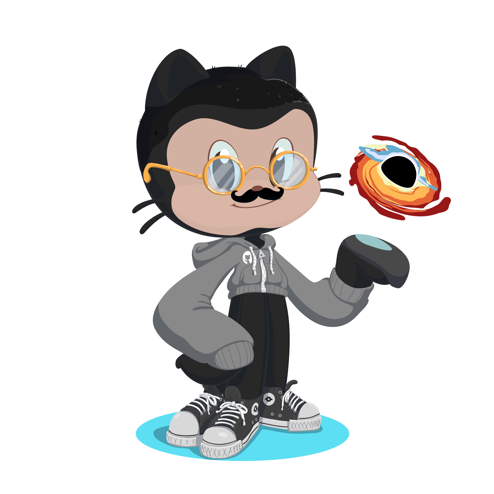

 

## Gabriel de Freitas 

	

## About me

	
	- 👋 Hi there, I'm @gabrielfreitas-az! 
	- 📚 I’m interested in theoretical and computational physics, 
	- 🧬 Currently, I'm an undergradute in Biomolecular Physics at University of São Paulo,
	- 👨‍💻 The best way to find me is on discord: Space Cowboy#9665.

	<a href="https://github.com/gabrielfreitas-azr">
	
	

          

    
          

<!---
gabrielfreitas-azr/gabrielfreitas-azr is a ✨ special ✨ repository because its `README.md` (this file) appears on your GitHub profile.
You can click the Preview link to take a look at your changes.
--->
